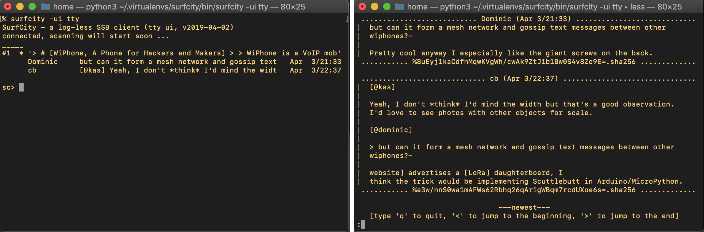

# SurfCity
A family of Python clients for Secure Scuttlebutt

2019-06-09: not ready yet for distribution, because it lacks:
- handling of network disconnection
- log extension code: staging to the SQlite DB first
- more thorough testing of log extension code (incl signing)

## Context and Prerequisits

SurfCity is a family of Python-based chat clients for Secure Scuttlebutt
(SSB), currently in pre-alpha stage.  See
[https://www.scuttlebutt.nz/](https://www.scuttlebutt.nz/) for more
details about the SSB community and other SSB clients.

SurfCity currently features three different user interfaces: tty, TUI
(Urwid toolkit) and a portable GUI based on Kivy (only partially
implemented). Internally, the three client programs use the same
common application core.

Beside the fun of having a terminal user interface (TUI), SurfCity is
an experiment in having a log-less SSB client. This means that
SurfCity only keeps the messages of the last two weeks or so, reducing
the storage footpring by an order of magnitude over PatchWork and
similar full clients. See the "Surfing the SSB Wavefront" section
below for the concept of a log-less client. If successful, the
wavefront riding concept will be ported to smartphones for a snappy
onboarding experience and as a fast day-to-day console into the
scuttleverse.

To use SurfCity, you must already have a Secure Scuttlebutt identity
(i.e. the ```~/.ssb./secret``` file), as this client does not provide
onboarding yet. The log is not required (and if one is on your device,
it is not touched). This means you need to know the coordinates of a
SSB server (pub) to which your client can connect. See
[here](https://github.com/ssbc/ssb-server/wiki/Pub-Servers) for a list
of Internet addresses.  Alternatively, you can try out SurfCity
locally if you have a ```sbot``` server running on your machine (this is
automatically the case if you use a desktop client like PatchWork):
just have this server up and running before you start SurfCity.


## How to install

```
pip3 install surfcity
```

or if you grabbed the source code:

```
python3 setup.py install
```


## How to start

In case you have a local sbot server (or PatchWork etc) running, for
Linux or MacOS terminal window:
```
surfcity
```

TTY (printer console):
```
surfcity -ui tty
```

More color choices:
```
surfcity -ui urwid          # default (dark mode)
surfcity -ui urwid_light    # works for 16-color terminals
surfcity -ui urwid_amber    # warm amber on black
surfcity -ui urwid_green    # classic green on black
surfcity -ui urwid_mono     # monochrome, using the terminal's default colors
```


If you wish to connect to a remote server, add the pub's coordinates as follows (example):
```
surfcity -pub ssb.organicdesign.pub:8008:@XgC5wDA2EW++ufaDrjRDHXA7Dyd1ce5bTenCm2u6PZU=.ed25519
```

Note that you must give _the **pub**'s public key_ as the third component
of this long name - by this you state that you trust the pub.


## Gallery


Four screenshots of the default URWID-based TUI (dark mode)

---


More color modes of the URWID TUI: light, amber, green, monochromatic

---


SurfCity runs inside the Android Termux app in touchscreen mode! The
'back' button is not integrated: touch the upper left corner for going
back, and the upper right corner for accessing the menu.

---



TTY user interface

---


Kivy-based GUI (only this demo page is implemented)


## Supported Functionality

* compact and time-ordered list of public threads, read threads
* compact and time-ordered list of private conversations, read private convos
* write public posts (new as well as reply)
* write private posts (new as well as reply)
* display of followed ids (user directory)
* a SQLITE database is used internally (~/.ssb/surfcity.sqlite)

## Missing Functionality

* likes (both displaying them as well as setting/unsetting)
* friend management (setting the follow/unfollow/block status)
* channels
* search
* fetching or uploadig blobs (including images)
* recovery from temporary disconnections, pub switching
* onboarding, incl LAN-local discovery of other clients
* "gathering", "chess", and many other SBB-apps
* remembering pubs (for easy referencing at startup)


## Surfing the SSB Wavefront (the philosophy of SurfCity)

Secure Scuttlebutt (SSB) brings to you a deluge of information, all
appended to the message logs of the respective authors:

     SurfCity is the tool to ride this wavefront.

The SurfCity client does so (a) in forward as well as (b) in backward
direction and (c) widens its scan range dynamically, but WITHOUT
having to store all the participants' huge log files.

Typically, the storage footprint of SurfCity is in the range of tens
of MBytes, while a full SSB client easily requires several hundreds of
MegaBytes of disk storage. Also, when booting freshly into SurfCity,
you will immediately have messages to display: no need to wait for
long download times and indexing pauses.  In that sense SurfCity is
sustainable, riding the wave with roughly constant storage space - at
least if YOU behave sustainably, e.g. block or un-follow peers if the
list becomes too large ;-)

Note that SurfCity still stores _some_ of the SSB messages in a local
database. Within that dataset you can still read SSB content even when
offline. You can also write messages when offline - they will be uploaded
when you regain connectivity.

### What does "riding the wavefront" mean?

a) By this we mean that SurfCity's most important task is to
scan the Scuttleverse for new content in the **forward** direction.
SurfCity will process these fresh messages and store them for a
few weeks only. It will also take note of a discussion thread's
first post and keeps this information around for a few months
so it can later display the thread's "title". Finally, SurfCity
keeps track of the SSB crypto peer identifiers and the human-
readable names that have been assigned to them.

b) SurfCity is also able to scan content in **backwards** direction.
From these "historic" messages, SurfCity collects essential
information e.g. the name that a peer has assigned to him/herself,
or the other peers that a peer follows or blocks. Eventually this
background scan bottoms out when the logs of all followed peers
have been scanned entirely.

c) Finally, the **breadth** of the wavefront is enlarged as SurfCity
learns about whom you are following. In this case, these peers
are added to your "following list" and are also scanned. This is
part of the SSB concept that messages sent by a peer are only
accessible in that peer's log, hence the need to scan it. The
width of the wavefront is even larger than this, as the followed
peers of a followed peer (FOAF, "friends of a friend") are also
scanned. SurfCity scans these FOAF peers less frequently by
randomly picking some of them, in each round. But it's all
fine because SSB is based on eventual concistency, and random
selection will eventually lead SurfCity to visit every peer
within the wavefront's current breadth.

### Prototype and Future Work

Beware, this is experimental software! Its main purpose is to
validate the concept of wavefront riding for SSB and to prepare
the ground for a SSB browser that can run on a smartphone but
does not come with a huge storage requirement.

--- eof
